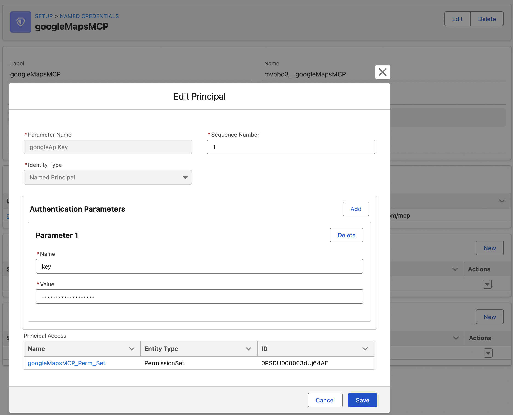
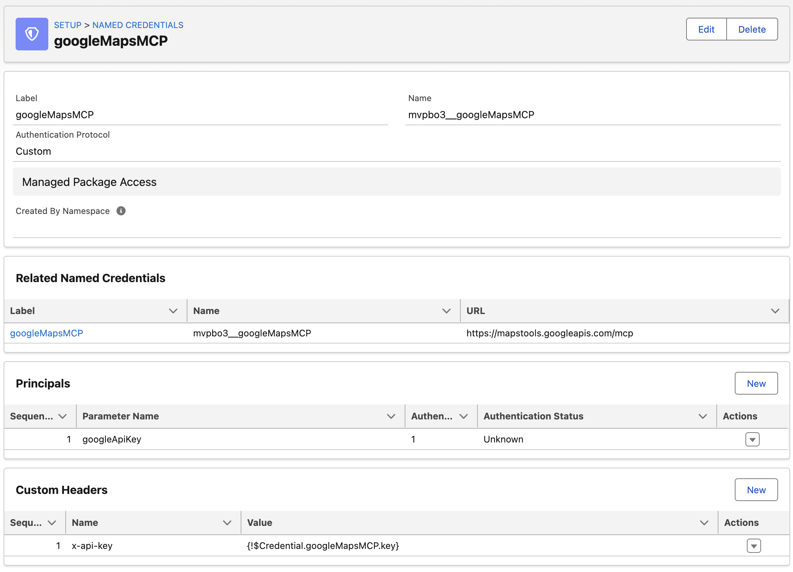
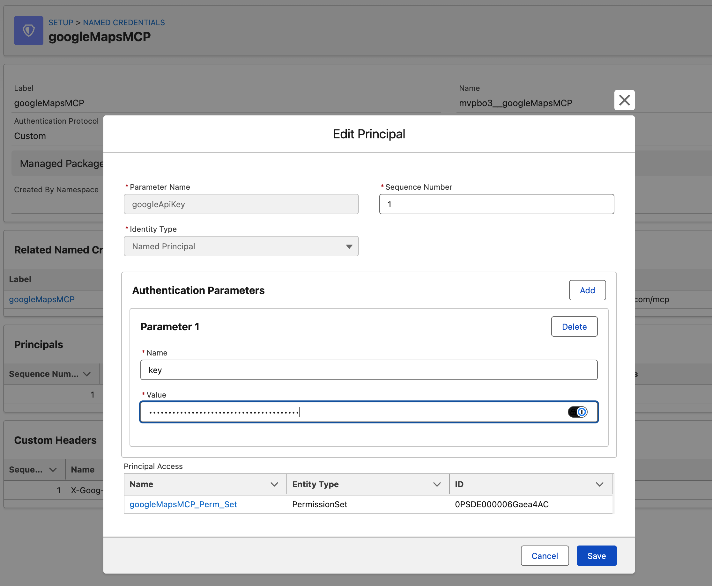

# Google Maps MCP

A reference architecture for configuring managed packages containing MCP servers that utilize custom headers for authentication. When packaging the MCP Server Registration, the API key will not be included and instead we need the subscriber to enter their own API key after installation.

In this example, we connect to the [Google Maps Grounding Lite MCP Server](https://developers.google.com/maps/ai/grounding-lite/reference/mcp) using an [API key](https://docs.cloud.google.com/mcp/authenticate-mcp#api-keys-services-that-dont-require-principal) rather than Bearer Token.

## Metadata Organization

To package an external MCP Server Registration, four metadata types are required: `externalCredentials`, `externalServiceRegistrations`, `namedCredentials`, and `permissionsets`. We'll be primarily working within the External Credential.

Within the External Credential, a Named Principal needs to be defined. The Named Principal will be made up of two parts, the Parameter Name (in our case 'googleApiKey') and one or more internal Authentication Parameters (ours is called 'key'). I recommend keeping these names distinct to make it easier to debug should anything go wrong.

Once the Authentication Parameters are set, go back to the External Credential and click 'New' within the Custom Headers section. Here we configure the actual header key and value that will be passed as a part of authenticated calls. The standard format to pass API keys to Google is `X-Goog-Api-Key`. In the value field, use merge field syntax to retrieve the Named Principal credential value `{!$Credential.googleMapsMCP.key}`. The format of this merge field is `"Credential".{External Credential API Name}.{Authentication Parameter Name}` **Note**- even though we are working in a namespaced scratch org, we do not include the namespace of the External Credential when specifying the API name. Additionally, we don't reference the name of the Named Principal Parameter Name (googleApiKey), instead we just reference the key value.

With this configuration in place, testing and ultimately packaging of the MCP server can take place.

## Install and Configure Package

Once package is installed on a subscribers org, the subscriber must navigate to the External Credential and edit the Named Principal. There, they will add an Authentication Parameter with a Name of 'key' and Value of {Google API Key}.

